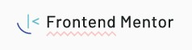

  

<h1 align='center'> Sunnyside agency landing page </h1>

	
	
	

_Para a versão em Português, clique [aqui](#portuguese)._ 

### Topics

- [Project description](#project-description)

- [Technologies used](#technologies-used)

- [What I learned](#what-I-learned)

- [Access the Project](#access-the-project)

 

## Project description

This is the landing page of a fictitious advertising agency. This project is one of the challenges proposed on the [Frontend Mentor](https://www.frontendmentor.io/home) site. The challenge is to recreate the project without the guidance of a design tool (figma) and making it as close as possible to the requested one. 

[The challenge](https://www.frontendmentor.io/challenges/sunnyside-agency-landing-page-7yVs3B6ef)

 

## Technologies used

  
  

 

## What I learned

- Use animation and @-webkit-keyframes to create the animated arrow;
- To make a more responsive-friendly code

 

## Access the Project

You can [access the project here](https://caroline-barbosa-vilar.github.io/sunnyside-agc/) 

Mobile

Tablet

Desktop 

 

<h1 align='center'> Sunnyside agency landing page </h1>

	
	
	

### Tópicos 

- [Descrição do projeto](#descrição-do-projeto)

- [Tecnologias utilizadas](#tecnologias-utilizadas)

- [O que aprendi](#o-que-aprendi)

- [Acesse o projeto](#acesse-o-projeto)

 

## Descrição do projeto 

Essa é a uma landing page de uma agência de publicidade fictício. Esse projeto é um dos desafios propostos no site [Frontend Mentor](https://www.frontendmentor.io/home) e o desafio é recriar o projeto sem o auxílio de ferramentas de design (figma) deixando-o mais próximo possível do solicitado. 

[O desafio](https://www.frontendmentor.io/challenges/sunnyside-agency-landing-page-7yVs3B6ef)

 

## Tecnologias utilizadas

  
  

 

## O que aprendi

- Como usar o grid para criar o layout;
- Usar o animation e @-webkit-keyframes para criar a seta animada.

 

## Acesse o projeto

Você pode [acessar o projeto aqui](https://caroline-barbosa-vilar.github.io/sunnyside-agc/) 

Mobile

Tablet

Desktop 

 

Developed with 🧡 by [me](https://www.linkedin.com/in/carolinebarbosavilar/)!
